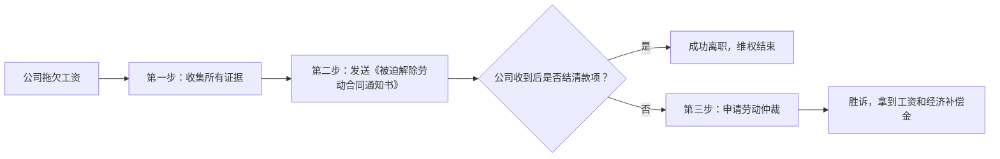

# 拖欠工资申请离职流程

好的，这是一份非常详细的关于“因拖欠工资而申请离职”的流程指南、注意事项和法律依据。遵循正确的流程可以最大限度地保护您的合法权益。

### 核心原则：主动离职也能要经济补偿金

通常员工自己主动辞职是没有经济补偿金的。但根据《劳动合同法》，**用人单位未及时足额支付劳动报酬的，劳动者可以解除劳动合同，并有权要求用人单位支付经济补偿金**。

所以，您的目标不仅仅是离职，而是**合法地、有证据地因公司过错而离职，并获取应得的工资和经济补偿**。

---

### 第一步：离职前的准备（收集证据）

这是最关键的一步，证据链是否完整直接决定您能否维权成功。

1.  **劳动关系证明**：
    *   **劳动合同**（最重要）。
    *   没有合同：工牌、工作证、工资条、银行流水、社保缴纳记录、盖有公章的文件、工作聊天记录等。

2.  **拖欠工资的证据**：
    *   **工资条**：显示应发和实发金额，突出未足额发放的部分。
    *   **银行流水**：证明公司未按时或未足额打款。
    *   **考勤记录**：证明您正常提供了劳动。
    *   **与公司沟通的记录**：
        *   **书面沟通**：通过邮件或内部办公系统（如钉钉、企业微信）向财务或领导询问拖欠工资事宜，并保留截图。**（这是非常有力的证据）**。
        *   **录音/录像**：与负责人当面或电话沟通时，在告知对方（或在未告知但不违法的情况下）进行录音，内容要清晰涉及“公司何时发工资”、“已经拖欠了XX个月的工资”等。

---

### 第二步：发送《被迫解除劳动合同通知书》

这是法律上的关键动作。**不要**只是口头提出离职，或者提交一份普通的《辞职信》。你必须明确表示：**我是因为公司拖欠工资才被迫离职的**。

1.  **书写内容**：
    *   标题：**被迫解除劳动合同通知书**
    *   公司全称：必须准确。
    *   您的个人信息：姓名、身份证号、岗位。
    *   解除原因：**明确写明“因贵单位未及时足额支付劳动报酬（具体拖欠XX年XX月至XX年XX月的工资共计XX元），根据《劳动合同法》第三十八条之规定，本人现提出解除劳动合同”。**
    *   要求：要求公司支付拖欠的工资、支付经济补偿金（N）、办理离职手续和社保转移。
    *   落款：您的签名和日期。

2.  **发送方式**（务必保留送达证据）：
    *   **EMS快递邮寄**：邮寄到公司注册地址或劳动合同上的地址。**保留好快递底单**，并在快递单上明确注明“被迫解除劳动合同通知书”。这是最推荐、最具法律效力的方式。
    *   **电子邮件**：发送给公司HR或法定代表人的邮箱，并请求已读回执。
    *   **当面送达**：让公司人员签收，并复印一份留存。如果对方拒收，可用手机录像证明您已送达但被拒。

**⚠️ 注意**：发送此通知后，您的劳动关系即告解除，无需公司批准。**通知送达满30天**后，您就可以直接去办理离职手续，如果公司不给办，可以采取下一步。

---

### 第三步：申请劳动仲裁（维权）

如果公司在您发出通知后，拒绝支付拖欠工资和经济补偿金，您需要立即启动法律程序。

1.  **申请地点**：公司注册地或劳动合同履行地的**劳动人事争议仲裁委员会**。
2.  **所需材料**：
    *   《劳动仲裁申请书》（说明事实、理由和诉求，如要求支付拖欠工资、经济补偿金等）。
    *   您的身份证复印件。
    *   公司的工商注册信息（可以在“天眼查”或“国家企业信用信息公示系统”查询）。
    *   **第一步中收集的所有证据**的复印件。
    *   **您发送的《被迫解除劳动合同通知书》及送达证明**（如快递底单）。

3.  **时效性**：劳动仲裁的申请时效通常为**一年**，从您知道权利被侵害之日（即公司发薪日但没发）起算。

---

### 第四步：应对与结果

*   **调解**：仲裁委员会通常会先组织调解。如果公司愿意支付，可以达成调解协议。
*   **开庭裁决**：调解失败则开庭审理。由于拖欠工资事实清晰，您证据充分，您胜诉的概率极高。
*   **法院诉讼**：如果对仲裁结果不服，任何一方可以在收到裁决书后15日内向人民法院提起诉讼。

---

### 总结与流程图

**总流程：收集证据 → 发送被迫解除通知 →（协商）→ 申请劳动仲裁 → 拿到赔偿**

### ⚠️ 重要注意事项

1.  **不要写“辞职信”**：普通辞职信会被视为您个人原因离职，无法索赔。
2.  **不要主动放弃任何权利**：不要签署任何声称“双方再无任何经济纠纷”的文件，除非钱已到手。
3.  **同步进行**：在申请仲裁的同时，可以开始找新工作，两者不冲突。
4.  **寻求帮助**：如果觉得个人处理困难，可以咨询当地**法律援助中心**或**总工会**寻求帮助。

希望这份指南能帮助您顺利解决问题并维护自己的合法权益！